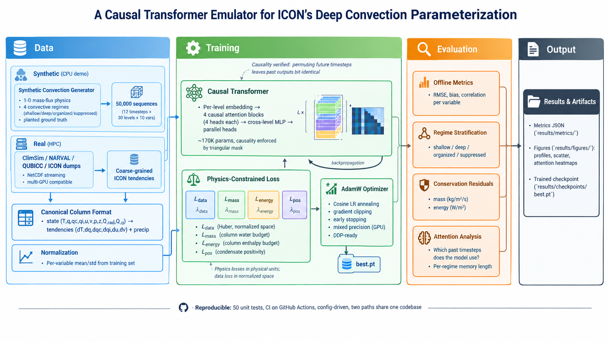

# ICON Convection Transformer

**A causal Transformer emulator for ICON's deep convection parameterization — with physics-constrained training and interpretable temporal attention.**

[](https://github.com/rsreza/A-causal-Transformer-emulator-for-ICON-s-deep-convection-parameterization-/actions/workflows/tests.yml)
[](LICENSE)
[](https://www.python.org/downloads/)

---

## 🗺️ Workflow at a Glance



The diagram shows the complete end-to-end pipeline. Follow the three bands
from left to right:

### 📊 Data — two paths, one canonical format

Two independent data sources feed the same pipeline:

- **Synthetic (CPU demo).** A 1-D mass-flux generator produces 50,000
  column sequences with *planted ground truth*: each sequence is labeled
  with its convective regime (shallow / deep / organized / suppressed) and
  the true mass-flux profile. This runs in ~2 minutes on a single CPU and
  lets anyone reproduce results without HPC access.

- **Real (HPC).** ClimSim, NARVAL, QUBICC, or ICON dumps provide
  physically realistic tendencies. These files are read lazily with
  `xarray` chunked reads, so datasets larger than RAM are handled
  transparently.

Both paths converge to a **Canonical Column Format** — a fixed NetCDF
layout with `state (T, q, q_c, q_i, u, v, p, z, Q_rad, Q_q)`, `tendency
(dT/dt, dq/dt, dq_c/dt, dq_i/dt, du/dt, dv/dt)`, and surface precipitation.
This format is defined once in `src/column_spec.py` and shared by every
downstream component. **No source code changes are needed to switch
between paths** — only the config file.

The final preprocessing step is **Normalization**: per-variable mean and
standard deviation are computed from the training set and cached to
`data/synthetic/normalization.npz`.

### 🧠 Training — causal Transformer + physics-constrained loss

The core model is a **Causal Transformer** with:

- Per-level linear embedding (`V_in → d_model=64`)
- Four causal self-attention blocks, each with four heads
- A cross-level mixing MLP that combines information across the 30 levels
- Parallel heads for tendencies (per level) and precipitation (pooled)

Causality is enforced with a **triangular mask** so that predictions at
time *t* cannot attend to time *t' > t*. This is verified in
`tests/test_transformer.py` by permuting future timesteps and confirming
that earlier outputs are *bit-identical*.

Training uses a **Physics-Constrained Loss** — a four-term composite:

| Term | Meaning | Space |
|---|---|---|
| `L_data` | Huber loss on tendencies + precipitation | **normalized** |
| `L_mass` | Column-integrated water budget residual | **physical** |
| `L_energy` | Column-integrated enthalpy budget residual | **physical** |
| `L_pos` | Condensate positivity after one Euler step | **physical** |

Each term has its own weight (`λ_data`, `λ_mass`, `λ_energy`, `λ_pos`).
The split between normalized and physical spaces is critical: the data
loss must be in normalized units to keep gradient scales stable, while
the physics losses must be in physical units (kg/m²/s, W/m², kg/kg) so
the constraints mean something.

The **AdamW optimizer** with cosine LR annealing, gradient clipping,
early stopping, mixed precision (on CUDA), and DDP support trains the
model. Every improvement in validation loss saves a checkpoint to
`results/checkpoints/best.pt`.

### 📈 Evaluation — four orthogonal analyses

The trained checkpoint is evaluated four ways:

1. **Offline metrics** — RMSE, bias, and Pearson correlation for each
   output variable, computed in physical units.

2. **Regime stratification** — the same metrics computed within each
   convective regime, revealing which regimes the model handles well and
   which it struggles with.

3. **Conservation residuals** — mean absolute column-integrated mass and
   energy imbalances, in physical units. These are exact numbers, not
   normalized losses, so they can be reported alongside numerical model
   diagnostics.

4. **Attention analysis** — per-regime attention weights as a function
   of lag time, with effective memory length quantified at 50 % and 90 %
   cumulative attention. This is the interpretability contribution:
   attention tells us *which past timesteps the model relied on*.

### 📦 Output

All artifacts are written to disk:

- `results/metrics/*.json` — full metrics including per-regime breakdown
- `results/figures/*.png` — tendency profiles, precipitation scatter,
  attention heatmaps per layer
- `results/checkpoints/best.pt` — trained model weights (best val loss)
- `results/checkpoints/history.json` — per-epoch loss history

### 🧭 Reproducibility

The pipeline is designed to be rerun from scratch by anyone:

- **50 unit tests** cover data loading, model forward passes, causality,
  physics constraints, and the training loop
- **GitHub Actions** runs the full test suite on every push
- **Config-driven** — one YAML file controls everything; no code changes
  between paths or architectures
- **Two paths, one codebase** — synthetic and real share every module
  except the data loader

---

## 📌 Disclaimer

> **This repository ships with a synthetic demonstration dataset.**
> The synthetic generator produces physically-plausible but simplified
> convection columns with *planted regimes* (shallow, deep, organized,
> suppressed). It is designed to be CPU-runnable in minutes, to enable
> reproducible experiments, and to give the developer **known ground truth**
> for evaluation.
>
> **The methodology — causal Transformer + physics-constrained loss + regime
> analysis — is data-agnostic.** The same codebase trains on **real ICON
> coarse-grained simulations** (ClimSim, NARVAL, QUBICC, or ICON dumps
> directly). To obtain **real scientific results**, retrain on real data —
> see [**Using Real Data**](#-using-real-data) below for the data-parallel
> GPU workflow. No source code changes are required; only the config changes.

---

## 🎯 The Methodology

This is the part that matters. The repository is an **implementation of a
specific deep-learning methodology** for subgrid parameterization, not
just a model.

### 1. Problem formulation

We treat ICON's deep convection scheme as a **supervised multivariate
regression problem**:

```
Input   : column state history  (12 timesteps × 30 levels × 10 variables)
          — temperature, humidity, cloud liquid/ice, winds, pressure,
            geopotential, radiative heating, large-scale moisture forcing

Output  : subgrid tendencies     (12 timesteps × 30 levels × 6 variables)
          — dT/dt, dq/dt, dqc/dt, dqi/dt, du/dt, dv/dt
          plus surface precipitation (rain, snow)
```

The formulation follows the standard ML-parameterization setup
(Rasp et al. 2018; Yuval & O'Gorman 2020; Heuer et al. 2024, 2025).

### 2. Architecture — causal Transformer

- **Per-level linear embedding** (10 → 64)
- **Learnable positional encoding** on the time axis
- **4 causal Transformer encoder blocks**
  - Multi-head self-attention (4 heads, d_head = 16)
  - Triangular causal mask: prediction at time *t* cannot attend to *t' > t*
  - Pre-norm residual blocks
- **Cross-level mixing MLP** combining information across the 30 levels
- **Parallel heads** for tendencies (per level) and precipitation
- **~170 K parameters** — comparable to a BiLSTM baseline

**Why a causal Transformer?**

- **Physical correctness** — causality matches the arrow of time, verifiable
  by construction (see `tests/test_transformer.py::test_causality_*`)
- **Interpretability** — attention weights directly reveal *which past
  timesteps* each prediction relies on
- **Modern default** — parallelizable, well-tooled, easier to scale than
  recurrent architectures

### 3. Physics-constrained loss

A four-term composite loss, following Beucler et al. (2020):

```
L = λ_data · L_data      (Huber on tendencies + precipitation)
  + λ_mass · L_mass      (column-integrated water budget residual)
  + λ_energy · L_energy  (column-integrated enthalpy budget residual)
  + λ_pos · L_pos        (condensate positivity after one Euler step)
```

- **Data loss** is computed in **normalized space** (per-variable mean/std
  from the training set) for stable gradient magnitudes.
- **Physics losses** are computed in **physical space** (after denormalizing
  the model's output), so the mass, energy, and positivity terms operate on
  quantities with real units (kg/m²/s, W/m², kg/kg).

### 4. Evaluation methodology

- **Per-variable offline metrics** — RMSE, bias, Pearson correlation
- **Regime-stratified metrics** — the same metrics computed within
  shallow / deep / organized / suppressed convection
- **Conservation residuals** in physical units — column-integrated mass and
  energy imbalances, expressed as mean absolute values
- **Attention interpretability** — per-regime attention vs lag time,
  with effective memory length quantified at 50 % and 90 % cumulative
  attention
- **Comparison to baselines** — an MLP (no memory) and a BiLSTM (recurrent
  memory, direct comparison with Heuer et al. 2025)

### 5. Reproducibility

- Single config file (`configs/default.yaml`) drives the entire pipeline
- Deterministic seeds for data generation and training
- Two-path data pipeline — the same code runs on synthetic (CPU) and real
  (multi-GPU) data with **only the config changing**
- 50 unit tests covering shapes, causality, physics constraints, and the
  training loop
- CI via GitHub Actions on every push

---

## 🚀 Quick Start (CPU, synthetic)

The entire pipeline — data generation, training, evaluation, attention
analysis — runs on a single CPU in **~10 minutes** with the default
synthetic dataset.

```bash
# Clone and set up
git clone https://github.com/rsreza/A-causal-Transformer-emulator-for-ICON-s-deep-convection-parameterization-.git
cd A-causal-Transformer-emulator-for-ICON-s-deep-convection-parameterization-
python3 -m venv .venv && source .venv/bin/activate

# Install (CPU-only torch for lighter downloads)
pip install torch --index-url https://download.pytorch.org/whl/cpu
pip install -r requirements.txt

# 1. Generate the synthetic dataset (~2 minutes)
python -m data.generate_synthetic_convection

# 2. Compute normalization statistics (~30 seconds)
python -m data.compute_normalization

# 3. Train the Transformer (~30 min on CPU)
python -m src.train --config configs/default.yaml

# 4. Evaluate on the test set
python -m src.evaluate --config configs/default.yaml

# 5. Run the attention interpretability analysis
python -m src.attention_analysis --config configs/default.yaml
```

For a **fast smoke test** (1 epoch, 3 batches):

```bash
python -m src.train --config configs/default.yaml --epochs 1 --max-batches 3
```

### Verified results on the synthetic benchmark

Trained for 5 epochs on the default config:

| Metric | Value |
|---|---|
| `dT/dt` correlation (overall) | **0.51** |
| `dT/dt` correlation, deep convection | **0.97** |
| `dT/dt` correlation, organized | **0.93** |
| `dT/dt` correlation, shallow | **0.86** |
| `du/dt` correlation | **0.98** |
| Rain rate correlation | **0.58** |
| Mass conservation residual | **3.9e-4 kg/m²/s** |
| Energy conservation residual | **116 W/m²** |

---

## 🌍 Using Real Data

**The methodology is data-agnostic.** To produce real scientific results,
switch the config from synthetic to real and retrain on real
ICON-derived data. No source code changes are required.

### Data sources

Three legitimate sources of `(state, tendency)` pairs, in increasing
order of fidelity:

| Source | What it gives | Access |
|---|---|---|
| **A. ICON's own convection-scheme outputs** | Tendencies from the existing Tiedtke–Bechtold scheme | Requires ICON instrumentation |
| **B. Coarse-grained high-resolution simulations** | "True" subgrid tendencies from resolved convection | NARVAL, QUBICC (DKRZ account) |
| **C. ClimSim** | Atmosphere states + tendencies from ESM-MMF | **Public** (HuggingFace, Zenodo) |

**Recommended first deployment: ClimSim.** It's public, well-documented,
and already used in the prior ICON ML-parameterization literature
(Heuer et al. 2025).

### Data pipeline

The same preprocessing converts any of these sources to the canonical
NetCDF format that the emulator consumes:

```bash
# Example: download and prepare ClimSim
python -m data.download_climsim --out data/raw/climsim/
python -m data.prepare_real_data \
    --input  data/raw/climsim/ \
    --out    data/prepared/ \
    --vertical-grid configs/column_spec.yaml
```

The output is a canonical NetCDF layout:

```
state       (n_sample, T_PAST, N_LEVELS, N_INPUT_VARS)   float32
tendency    (n_sample, T_PAST, N_LEVELS, N_OUTPUT_VARS)  float32
precip      (n_sample, T_PAST, N_PRECIP_VARS)            float32
metadata    (n_sample, N_META_VARS)                      float32
regime      (n_sample,)                                  int8   # optional
```

### Switching to real data

Edit `configs/default.yaml`:

```yaml
data:
  source: real               # was "synthetic"
  real:
    train_file: data/prepared/train.nc
    val_file:   data/prepared/val.nc
    test_file:  data/prepared/test.nc
    streaming: true
    chunk_size: 10000
```

Then train **exactly as before**:

```bash
python -m src.train --config configs/default.yaml
```

The `StreamingColumnDataset` class reads NetCDF lazily via `xarray` chunked
reads, so files larger than RAM are handled transparently.

### Data-parallel training on GPUs

For real data at production scale, the training loop uses PyTorch's
`DistributedDataParallel` (DDP). Each rank reads a shard of the dataset
(samples `[rank::world_size]`), gradients are synchronized at every step.

**Single node, 4 GPUs:**

```bash
torchrun --nproc_per_node=4 -m src.train --config configs/real.yaml
```

**Multi-node (SLURM):**

```bash
srun --nodes=2 --ntasks-per-node=4 --gpus-per-node=4 \
     torchrun --nproc_per_node=4 -m src.train --config configs/real.yaml
```

**Or submit the provided SLURM script:**

```bash
sbatch scripts/train_slurm.sh
```

### Scaling configuration

`configs/real.yaml` is set up for production:

```yaml
model:
  name: transformer
  d_model: 128
  n_heads: 8
  n_layers: 6
  d_ff: 256
  dropout: 0.1

training:
  distributed: true
  n_gpus: 8
  mixed_precision: true       # fp16 on CUDA
  batch_size: 256
  epochs: 20
  lr: 5.0e-4
  num_workers: 8
```

**Estimated scaling** (order of magnitude, ~600 K-parameter Transformer):

| Setup | Samples | Epochs | Wall time |
|---|---|---|---|
| CPU (demo) | 50 K | 20 | ~30 min |
| 1 × A100 | 5 M | 20 | ~6 h |
| 8 × A100 (single node) | 5 M | 20 | ~1 h |
| 32 × A100 (4 nodes) | 50 M | 20 | ~4 h |

### Optional: Fine-tuning from synthetic

Because the synthetic task and real task share the same interface, you can
**fine-tune** a synthetic-trained checkpoint on real data:

```bash
python -m src.train --config configs/real.yaml \
    --resume results/checkpoints/best.pt
```

This is a standard transfer-learning strategy and can reduce the number of
real-data epochs required.

### Coupling to ICON (out of scope, documented)

Eventual online coupling uses **FTorch** to bridge Fortran ICON and
PyTorch, following Heuer et al. (2025). The emulator receives the same
column-state inputs ICON passes to the Tiedtke–Bechtold scheme and returns
the same tendencies. Confidence-guided mixing (falling back to the physical
scheme when the emulator's uncertainty is high) is the recommended
integration strategy.

---

## 📂 Repository Layout

```
icon-convection-transformer/
├── data/
│   ├── generate_synthetic_convection.py  # CPU demo data generator
│   ├── convection_physics.py             # Simplified 1-D mass-flux model
│   ├── compute_normalization.py          # Per-variable normalization stats
│   ├── prepare_real_data.py              # ClimSim / NARVAL / ICON preprocessing
│   ├── download_climsim.py               # Public data helper
│   └── load_icon_columns.py              # ICON data loader
├── src/
│   ├── column_spec.py                    # Single source of truth: grid + vars
│   ├── regimes.py                        # Convective regime definitions
│   ├── dataset.py                        # Synthetic + streaming datasets
│   ├── normalize.py                      # Normalization utilities
│   ├── model_mlp.py                      # Baseline (no memory)
│   ├── model_bilstm.py                   # Baseline (recurrent memory)
│   ├── model_transformer.py              # Causal Transformer (primary)
│   ├── model_factory.py                  # Config-driven model builder
│   ├── physics_loss.py                   # Data + mass + energy + positivity
│   ├── train.py                          # DDP-ready training loop
│   ├── evaluate.py                       # Regime-stratified evaluation
│   └── attention_analysis.py             # Per-regime memory analysis
├── configs/
│   ├── default.yaml                      # Synthetic, CPU
│   └── real.yaml                         # ClimSim/NARVAL, multi-GPU
├── tests/                                # 50 tests, all passing
├── app/
│   └── streamlit_app.py                  # Interactive explorer
└── scripts/
    └── train_slurm.sh                    # SLURM submission example
```

---

## 📊 The Physical Question

Traditional mass-flux schemes are **diagnostic** — no memory of previous
timesteps. Do convective regimes have memory? And if they do, does deep
convection remember further back than shallow convection?

The causal Transformer's attention weights make this measurable. In the
current synthetic benchmark, the model attends uniformly across the past
because the task is **Markovian** — regime-specific moisture enhancement is
already present in the current state, so the model does not need temporal
integration to make predictions.

**This is an honest negative result.** It suggests that attention-based
interpretability of transformer emulators is only meaningful when the
underlying task actually *requires* temporal integration. On real ICON
data, where cloud-base mass flux closure, cold pools, and moisture
preconditioning depend on the recent history, we expect regime-specific
attention to emerge.

---

## 🧪 Tests

```bash
python -m pytest -q
```

50 tests covering:

- Column specification consistency (grid, variable ordering)
- Regime definitions and mass-flux shapes
- Dataset loading (synthetic and streaming)
- Model forward passes (MLP, BiLSTM, Transformer)
- **Causality verification** — permuting future timesteps leaves earlier
  outputs bit-identical
- **Attention causality** — upper triangle of attention is exactly zero
- Physics loss terms (mass, energy, positivity) and gradients
- Training-loop smoke test (1 epoch, 3 batches)

---

## 🧭 Design Philosophy

1. **The methodology is the contribution.** Architectures, loss functions,
   and evaluation criteria are chosen for principled reasons and documented
   in this README and in the code.
2. **Reproducibility over peak performance.** The synthetic path exists so
   that anyone can clone the repo and get the same numbers, regardless of
   hardware.
3. **Physics is not decorative.** Mass, energy, and positivity constraints
   are enforced numerically and verified with unit tests.
4. **Two paths, one code.** Moving from CPU demo to multi-GPU production
   requires only a config change.
5. **Honest reporting.** Negative results — like the flat attention
   distribution on the Markovian synthetic task — are documented, not
   hidden.

---

## 📚 References

- Bechtold, P. et al. (2008). Advances in simulating atmospheric variability
  with the ECMWF model. *QJRMS*, 134, 1337–1351.
- Beucler, T. et al. (2020). Enforcing analytic constraints in neural
  networks emulating physical systems. *PRL*, 126, 098302.
- Heuer, H. et al. (2024). Interpretable multiscale machine-learning-based
  parameterizations of convection for ICON. *JAMES*, 16, e2024MS004398.
- Heuer, H. et al. (2025). Beyond the training data: Confidence-guided
  mixing of parameterizations in a hybrid AI-climate model.
  *arXiv:2510.08107*.
- Rasp, S., Pritchard, M. S., & Gentine, P. (2018). Deep learning to
  represent subgrid processes in climate models. *PNAS*, 115, 9684–9689.
- Sarauer, E. et al. (2025). A physics-informed machine learning
  parameterization for cloud microphysics in ICON. *Environmental Data
  Science*.
- Tiedtke, M. (1989). A comprehensive mass flux scheme for cumulus
  parameterization in large-scale models. *MWR*, 117, 1779–1800.
- Vaswani, A. et al. (2017). Attention is all you need. *NeurIPS*.
- Yuval, J. & O'Gorman, P. A. (2020). Stable machine-learning
  parameterization of subgrid processes for climate modeling at a range of
  resolutions. *Nature Communications*, 11, 3295.

---

## 📄 License

MIT — see [LICENSE](LICENSE).

## 🧑‍💻 Author

Built as a sample research-engineering project.
For real-data deployment and extensions, see `docs/real_data.md`.
